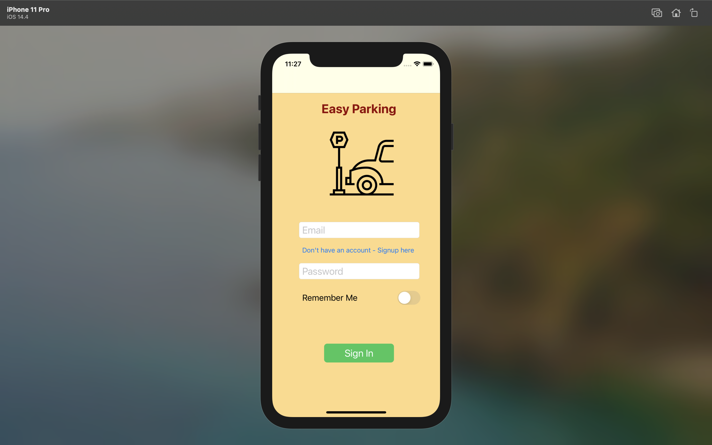
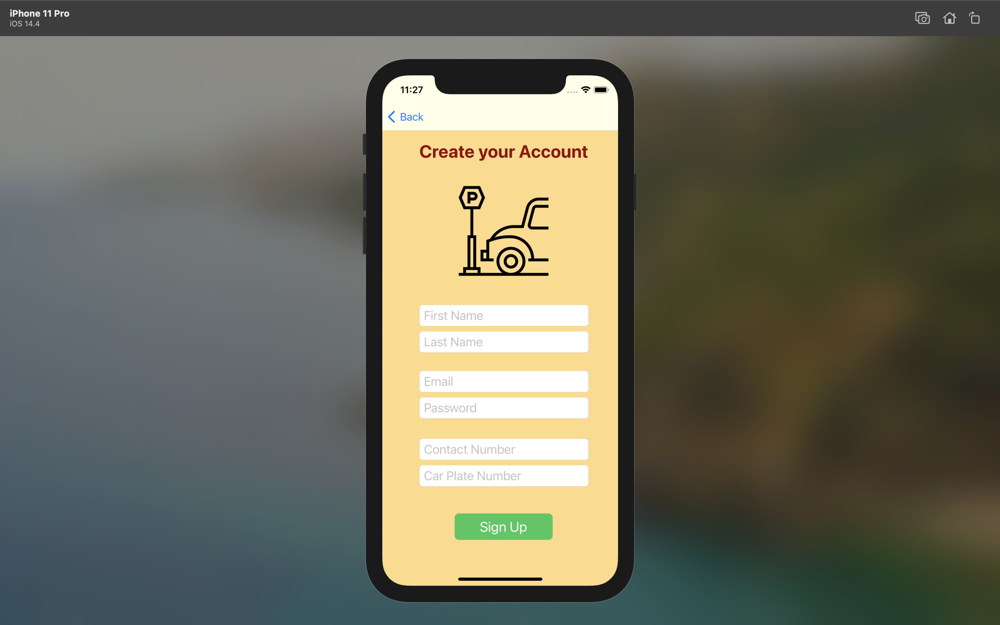
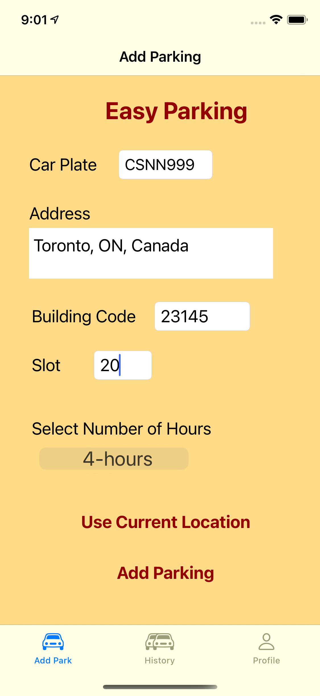
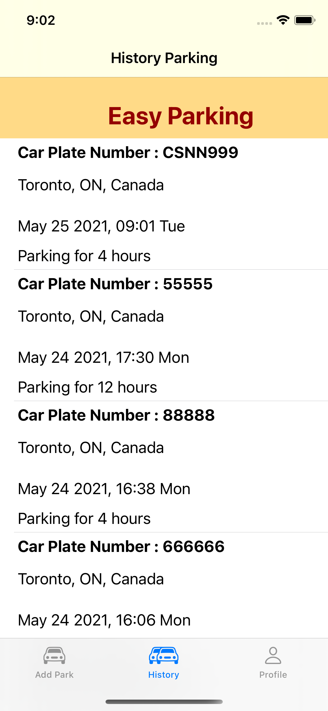
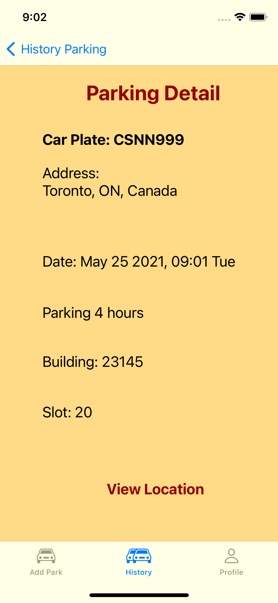

# ParkingApp - iOS

## Authors

[Wanja Mascarenhas](https://github.com/mascarenhaswanja)
student ID: 101280022
    
[Muzammil](https://github.com/muzz56)
student ID: 101281406 

## :books: Project Description

    iOS application for the Parking App
    
## :gear: Funcionalities

### :woman_office_worker: :man_office_worker: User Profile

    - Sign-up
    - Sign-in
    - Sign-out
    - Update profile
    - Delete account 
    
#### Entity User
    - Name  
    - Email 
    - Password 
    - Contact number 
    - Car plate number 
       
### :car: Add Parking

    - Create a new parking

#### Entity Parking
    
    - Building code 
    - No. of hours intended to park 
    - Car License Plate Number
    - Suit no. of host
    - Parking location (street address, latitude and longitude)
    - Date and time of parking 

### :parking: View Parking

    - View the list of all the parking the user made
    
## :woman_student: :man_student: Students tasks

``` sh

    For this project we choose Cloud Firestore Firebase as Database solution

    - By Muzammil
        - Sign
        - Signup
        - Update/Delete Profile

    - By Wanja:     
        - Add Parking
        - History Parking
```
---

### 🖼️ Screenshots

#### Sign In



---

#### Sign Up



---

#### Add Parking 

 

--- 

#### History Parking 

 

--- 

#### Detail Parking 

 

--- 


